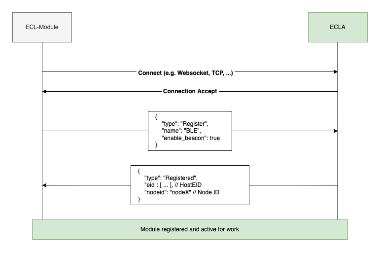
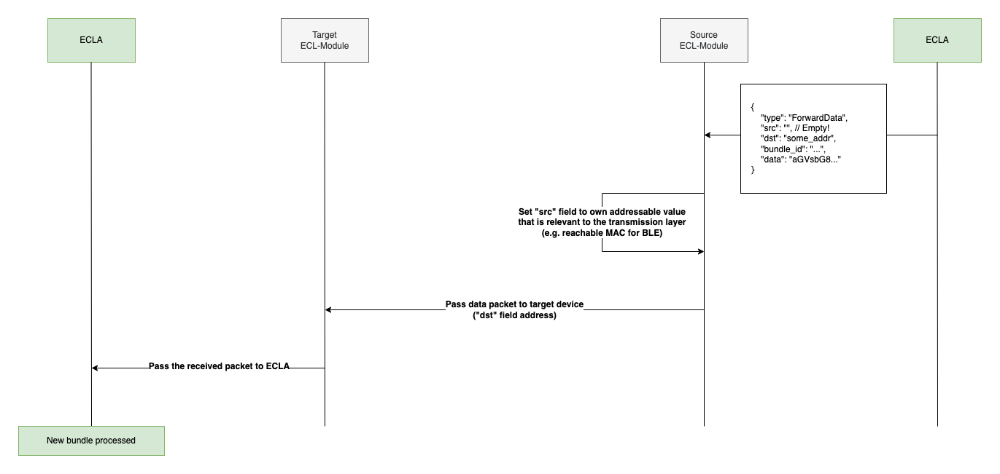
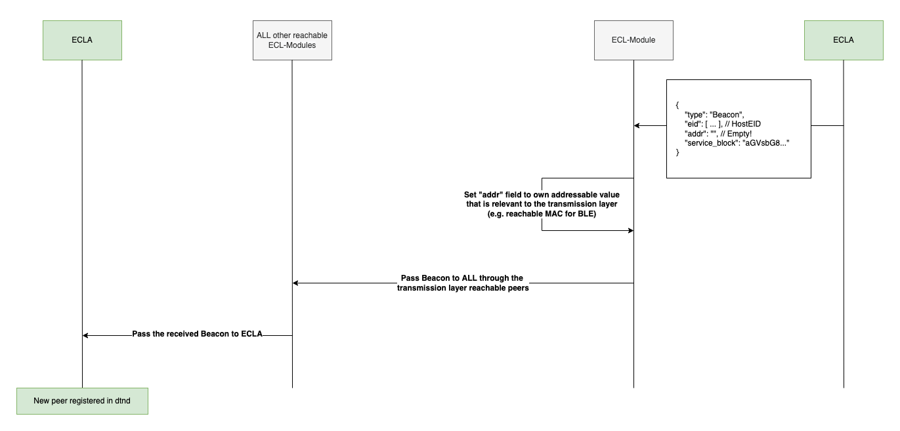

# ECLA


The External Convergence Layer Agent allows implementing Convergence Layer Agents externally (e.g. outside the dtn7-rs codebase). It works by exposing a realtime JSON API via WebSocket or TCP. With the help of the ECLA it is possible to easily implement new transmission layers in different languages. All languages that can encode / decode JSON and communicate via WebSocket or TCP should in theory work. Additionally, the ECLA contains a optional and simple beacon system that can be used for peer discovery.


A client that connects to the ECLA and implements a new transmission layer is called a External Convergence Layer Module (in short ECL-Module).

## Arguments

To enable the ECLA add the argument ``--ecla`` to dtnd.

## Transport Layer Agents

### WebSocket

The WebSocket is accessible under the same port as defined by ``-w``, ``--web-port`` and the route ``/ws/ecla``. An example for a web port 3000 would be ``127.0.0.1:3000/ws/ecla``.


### TCP

If the TCP Transport Layer is used the packets use a big-endian length delimited codec. More information about the codec can be found here: [tokio_util::codec::length_delimited](https://docs.rs/tokio-util/0.2.0/tokio_util/codec/length_delimited/index.html). This layer will be activated if the tcp port is set via the ``-ecla-tcp 7263`` flag.

```
+----------+--------------------------------+
| len: u32 |          frame payload         |
+----------+--------------------------------+
```

## Static Peers

Normally dntd won't accept static peers for CLAs that are not present at startup. In case of ECLAs where a CLA will be registered at a later time it is still possible to add peers with a different notation. A ``ecla+`` will indicate dtnd that the peer is intended for a ECLA and added without the CLA presence check.

**Example:** ``-s ecla+mtcp://127.0.0.1:4223/node2``

## Behaviour

### Registration

After the initial connect to the ECLA the first packet that must be send is the ``RegisterPacket`` that contains the name of the CLA and if the beacon system should be enabled. If the registration is successful the ECLA responds with a ``RegisteredPacket`` containing basic information about the connected dtnd node. If a error occured a ``ErrorPacket`` will be returned. Reasons for error can be:
- CLA with the same name is already registered
- Illegal name (e.g. empty)

#### Example Sequence



### Forward Data

``ForwardDataPacket`` contains bundle data. You can either receive this packet from the dtnd that the ECL-Module is connected to or from the transmission layer that the module implements.

#### Coming from dtnd

If you receive the packet from the dtnd that means the ECL-Module should send the packet to the address specified in ``dst`` field. If no ``dst`` is specified, for example when the transmission layer doesn't have addressable id's send the packet to all possible targets. In case the transmission layer has addressable id's you must set the ``src`` field to the address of the ECL-Module.

#### Coming from the Transmission Layer

If you receive a packet from the transmission layer you must pass it to the ECLA as it is.

#### Example Sequence



### Beacon

If the beacon is enabled dtnd will periodically send beacons to the ECL-Module acting as a basic peer discovery. The interval is specified by the ``announcement_interval`` (``-interval``, ``-i`` cli flag).

#### Coming from dtnd

If you receive the packet from the dtnd that means the ECL-Module can send the beacon to all reachable devices. If the transmission layer has addressable id's the ECL-Module should set the ``addr`` field to it's own id.

#### Coming from the Transmission Layer

If you receive a packet from the transmission layer you can pass it to the ECLA as it is.

#### Example Sequence



## Protocol

### Packets & Encoding

All packets are JSON encoded and contain a field called ``type`` which specifies (as the name implies) the type of the packet. The protocol is compact and contains only 5 different packet types:

### From dtnd

#### Error

dtnd → external

The ``Error`` packet will be emitted if an error happens while registration.

```json
{
  "type": "Error",
  "reason": "error text"
}
```

#### Registered

dtnd → external

The ``Registered`` packet will be emitted if the registration was successful.
- ``eid``: Endpoint ID of connected Node
- ``nodeid``: Raw Node ID as string

```json
{
  "type": "Registered",
  "eid": [1, "//nodex/..."],
  "nodeid": "nodex"
}
```

### From external

#### Register

external → dtnd

The ``Register`` packet must be sent as first packet to the ECLA to register the ECLA-Module.

- ``name``: Name of the new CLA
- ``enable_beacon``: If beacons should be periodically sent

```json
{
  "type": "Register",
  "name": "CLA Name",
  "enable_beacon": true
}
```

### Bidirectional

#### ForwardData

dtnd ⇄ external

- ``src``: Address of data source
  - If it is received from the ECLA it should be set to a reachable address in the transmission layer
- ``dst``: Address of data destination
- ``bundle_id``: String representation of Bundle ID
- ``data``: Base64 and CBOR encoded data containing the bundle information

```json
{
  "type": "ForwardData",
  "src": "...",
  "dst": "...",
  "bundle_id": "...",
  "data": "aGVsbG8...gd29ybGQ="
}
```

#### Beacon

dtnd ⇄ external

- ``eid``: Endpoint ID
  - If it comes from the ECLA **eid** is the Endpoint ID of the connected node
  - If it is received from the transmission layer the **eid** is the Endpoint ID of the foreign dtnd
- ``addr``: In transmission layer reachable address (Optional)
    - If it is received from the ECLA it should be set to a reachable address in the transmission layer
- ``service_block``: Base64 and CBOR encoded data containing available CLAs and Services

```json
{
  "type": "Beacon",
  "eid": [1, "//nodex/..."],
  "addr": "...",
  "service_block": "aGVsbG8...gd29ybGQ="
}
```

## Example: ECLA Rust WebSocket Client

An implementation for a Rust WebSocket Client is included in the `ecla` module.

```rust
use anyhow::Result;
use dtn7::cla::ecla::ws_client::{Command};
use dtn7::cla::ecla::{ForwardDataPacket, Packet, ws_client};
use futures::channel::mpsc::unbounded;
use futures_util::{future, pin_mut, StreamExt};
use log::info;

#[tokio::main]
async fn main() -> Result<()> {
    let (tx, rx) = unbounded::<Packet>(); // Packets from the client
    let (ctx, crx) = unbounded::<Command>(); // Commands to the client

    // Creating the client task
    let client = tokio::spawn(async move {
        let mut c =
                ws_client::new("myprotocol", "127.0.0.1:3002", "", tx, true).expect("couldn't create client");

        // Get the command channel of the client
        let cmds = c.command_channel();

        // Pass the new commands to the clients command channel
        let read = crx.for_each(|cmd| {
            cmds.unbounded_send(cmd)
                .expect("couldn't pass command to client channel");
            future::ready(())
        });
        let connecting = c.connect();

        // Wait for finish
        pin_mut!(connecting, read);
        future::select(connecting, read).await;
    });

    // Read from incoming packets
    let read = rx.for_each(|packet| {
        match packet {
            Packet::ForwardDataPacket(packet) => {
                info!("Got ForwardDataPacket {} -> {}", packet.src, packet.dst);

                // Send the ForwardDataPacket to the dst via your transmission layer
            }
            Packet::Beacon(packet) => {
                info!("Got Beacon {}", packet.eid);

                // Send the beacon somewhere via your transmission layer
            }
            _ => {}
        }

        future::ready(())
    });
    
    // Implement your transmission layer somewhere, receive ForwardDataPacket
    // and optionally Beacon packets. Pass them to the ECLA Client via the
    // ctx command channel (see 'Sending Packets' below).

    // Wait for finish
    pin_mut!(read, client);
    future::select(client, read).await;

    info!("done");

    Ok(())
}
```

### Sending Packets

Sending packet to the client if you received it from the transmission layer

```rust
ctx.unbounded_send(Command::SendPacket(Packet::ForwardDataPacket(
    ForwardDataPacket {
        data: vec![],
        dst: "dst".to_string(),
        src: "src".to_string(),
        bundle_id: "id".to_string(),
    },
))).expect("couldn't send packet");
```

### Closing the Client

```rust
ctx.unbounded_send(Command::Close)
    .expect("couldn't send close command");
```